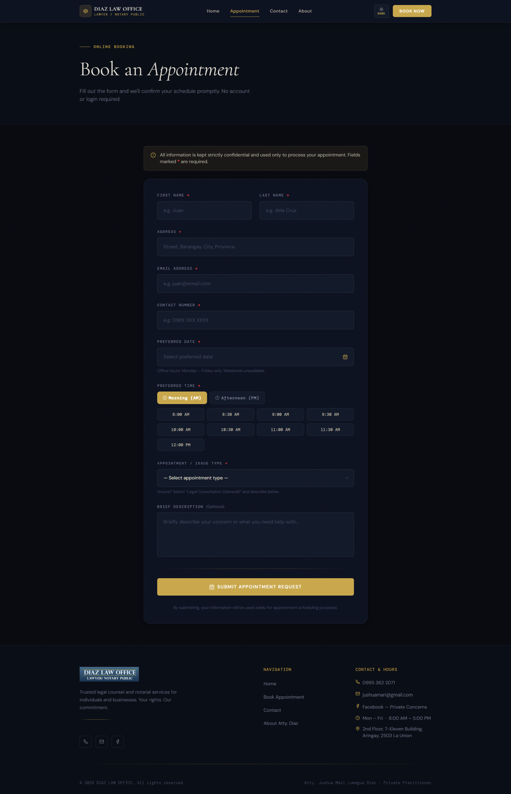
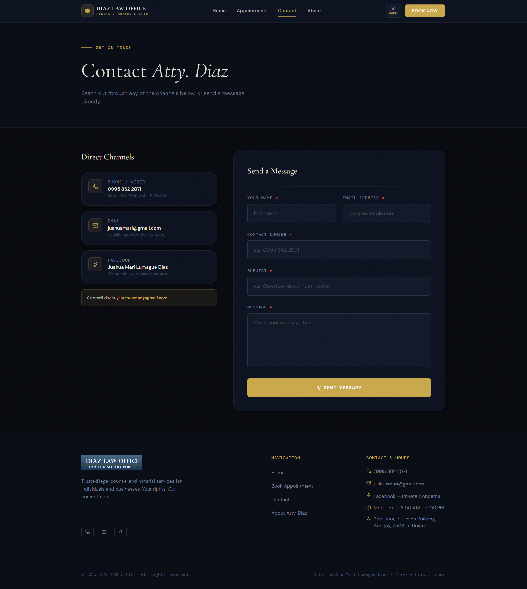
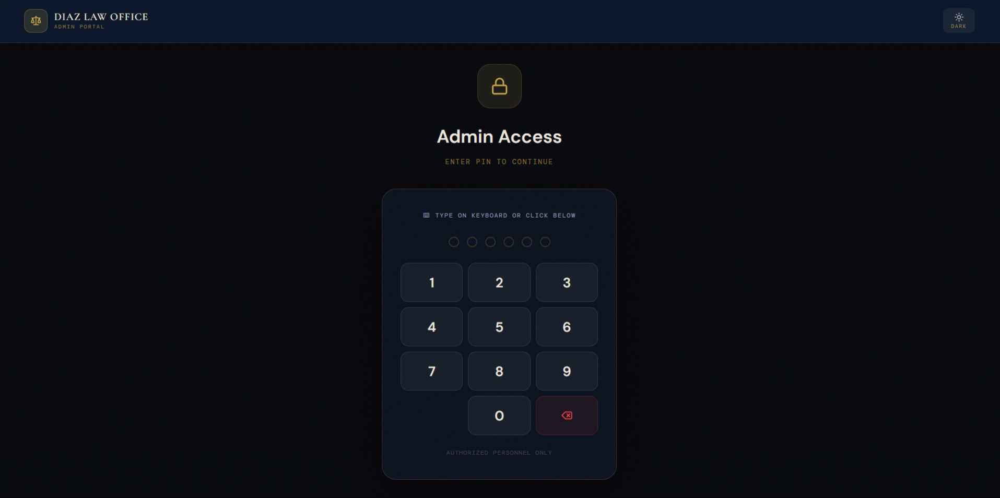
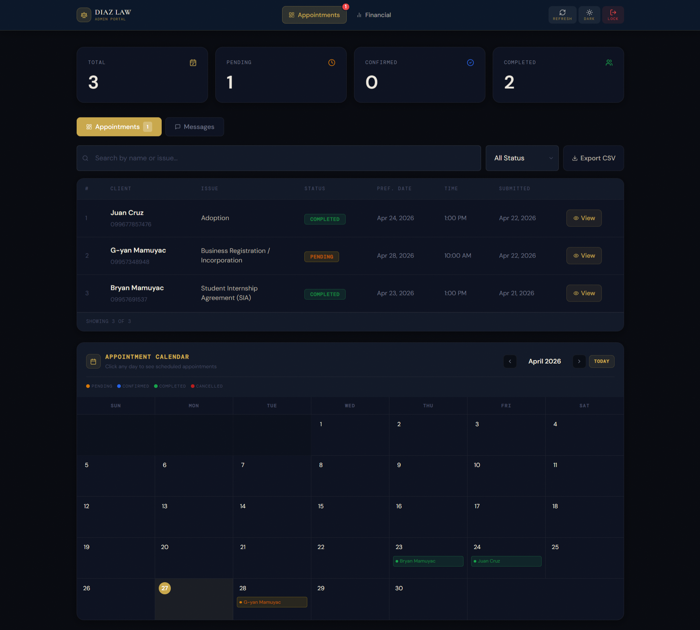

# ⚖️ DIAZ LAW OFFICE — Official Website & Admin System

**Atty. Jushua Mari Lumague Diaz**  
Lawyer · Notary Public · Private Practitioner  
*Est. July 2024 · Aringay, 2503 La Union, Philippines*

> A full-stack law office web platform featuring an online appointment booking system, client-facing public pages, and a secure private admin portal for appointment management and financial tracking.

---

## 🌐 Live Site

**[https://diaz-law.vercel.app](https://diaz-law.vercel.app)**

---

## 📸 Screenshots

### 🏠 Client — Home Page


The landing page presents a premium, professional first impression. Features a hero section with Atty. Diaz's photo, a brief introduction, primary call-to-action buttons (Book an Appointment / Contact Us), and trust indicators. The page also includes a services overview, stats bar, office location map, and a consultation CTA section.

---

### 🏠 Client — Home Page (Continued)


The lower section of the homepage showcases the four main service categories — Notarial Services, Legal Representation, Business & Contracts, and Legal Consultation — along with an interactive office location map powered by OpenStreetMap, and a footer with complete contact details and navigation links.

---

### 📅 Client — Book an Appointment


The public appointment booking form allows clients to submit a request without any account or login required. Fields include full name, address, email, contact number, preferred date (Mon–Fri only via custom calendar picker), preferred time slot (AM/PM grid), and appointment/issue type via a grouped dropdown. All data is stored securely in Supabase.

---

### 📬 Client — Contact Page


The contact page provides multiple ways to reach Atty. Diaz — phone/Viber, email, and Facebook. A direct message form allows visitors to send inquiries that are captured in the admin portal's Messages inbox. Contact hours and location details are clearly displayed.

---

### 👤 Client — About Page


The attorney profile page displays Atty. Diaz's credentials, educational background (Juris Doctor — Saint Louis University, Baguio City), areas of practice, core values, and a professional photo. Includes direct links to book an appointment or send a message.

---

### 🔐 Admin — PIN Login Screen


The admin portal is protected by a 6-digit PIN screen with lockout protection. After 5 failed attempts, the system locks for 3 minutes. Supports both on-screen numpad and physical keyboard input. Features a light/dark mode toggle. Authorized personnel only.

---

### 📋 Admin — Appointments Dashboard


The appointments tab provides a full management interface. Features include:
- **Summary stats** — Total, Pending, Confirmed, Completed counts
- **Searchable table** — Filter by name, issue, or status
- **Numbered pagination** — 10 appointments per page
- **Status management** — Update each appointment to Pending / Confirmed / Completed / Cancelled
- **Appointment Calendar** — Visual monthly calendar showing all scheduled appointments with color-coded status dots. Click any day to view details.
- **Messages inbox** — View and reply to client contact form submissions

---

### 💰 Admin — Financial Dashboard


The financial tab provides complete income and expense tracking for the law office. Features include:
- **Summary cards** — Total Revenue, Total Expense, Net Income (auto-calculated)
- **Charts** — Revenue vs Expense line chart and Daily Comparison bar chart with shared filter (Overall / Last 1–3 Weeks / By Month)
- **Add Record form** — Log revenue (Online or Walk-in, with client name and issue type) or expenses (with description). Invoice numbers are auto-generated but editable.
- **Transaction History table** — Filterable by type (Revenue/Expense) and month, with invoice number search. Paginated at 10 rows per page.
- **Export to Excel (.xlsx)** — Separate Revenue and Expense exports with smart filenames (e.g. `revenue_april2026.xlsx`), totals row included.

---

## ✨ Full Feature List

### Public Website
- Professional landing page with services overview and call-to-action buttons
- Online appointment booking — no account or login required
- Custom date picker (weekdays only) and AM/PM time slot grid
- Grouped appointment type dropdown (30+ service types)
- Contact form with direct messaging to admin inbox
- Attorney profile page with credentials and areas of practice
- Interactive office location map (OpenStreetMap)
- Light / Dark mode toggle
- Fully mobile-responsive design

### Admin Portal *(private access only)*
- PIN-protected login with lockout after failed attempts
- Appointment table with search, status filter, and numbered pagination
- Per-appointment detail modal — update status, confirm date, add secretary notes
- Visual appointment calendar with color-coded status indicators
- Messages inbox with unread badge, mark-read, delete, and email reply
- Financial records — revenue and expense tracking with full detail fields
- Auto-generated invoice numbers (editable)
- Walk-in client issue type dropdown (same 30+ services as public form)
- Revenue vs Expense line chart + Daily Comparison bar chart
- Shared chart filter — Overall / 1 Week / 2 Weeks / 3 Weeks / By Month
- Transaction history with invoice number search and pagination
- Export appointments to CSV
- Export financial records to Excel (.xlsx) with totals row
- Dark / Light mode with persistent preference

---

## 🛠️ Tech Stack

| Layer | Technology |
|---|---|
| Framework | Next.js 14 (App Router) + TypeScript |
| Styling | Tailwind CSS + CSS Variables (luxury gold theme) |
| Database | Supabase (PostgreSQL + REST API) |
| Deployment | Vercel |
| Charts | Custom SVG (no external chart library) |
| Export | SheetJS (xlsx) |
| Icons | Lucide React |
| Fonts | Cormorant Garamond · DM Sans · DM Mono |
| Date Utilities | date-fns |

---

## 📁 Project Structure

```
src/
├── app/
│   ├── page.tsx                    # Home page
│   ├── appointment/page.tsx        # Public booking form
│   ├── contact/page.tsx            # Contact page
│   ├── about/page.tsx              # Attorney profile
│   ├── admin-diazlaw-portal/
│   │   └── page.tsx                # Full admin dashboard
│   └── globals.css                 # Global styles & CSS variables
├── components/
│   ├── Navbar.tsx                  # Site navigation
│   ├── Footer.tsx                  # Site footer
│   └── ThemeProvider.tsx           # Dark/light mode context
└── lib/
    ├── supabase.ts                 # Supabase client & types
    └── constants.ts                # Issue types / service list
```

---

## 🗄️ Database Tables (Supabase)

| Table | Description |
|---|---|
| `appointments` | Client appointment requests with status, date, time, issue type |
| `contact_messages` | Messages sent via the contact form |
| `financial_records` | Revenue and expense records with invoice, client, and payment details |

---

## 🚀 Getting Started (Local Development)

```bash
# 1. Clone the repository
git clone https://github.com/your-username/diaz-law.git
cd diaz-law

# 2. Install dependencies
npm install

# 3. Set up environment variables
# Create a .env.local file with:
NEXT_PUBLIC_SUPABASE_URL=your_supabase_url
NEXT_PUBLIC_SUPABASE_ANON_KEY=your_supabase_anon_key

# 4. Run the development server
npm run dev

# 5. Open in browser
# http://localhost:3000
```

---

## 🔒 Security Notes

- Admin portal is PIN-protected with a 5-attempt lockout and 3-minute cooldown
- All data transmission is encrypted via HTTPS (Vercel + Supabase)
- Supabase Row Level Security (RLS) policies control data access
- No sensitive payment data (credit cards, IDs) is stored
- Environment variables are never exposed to the client

---

## 📝 License

Private and confidential project. All rights reserved.  
**Diaz Law Office © 2026** · Developed for Atty. Jushua Mari Lumague Diaz